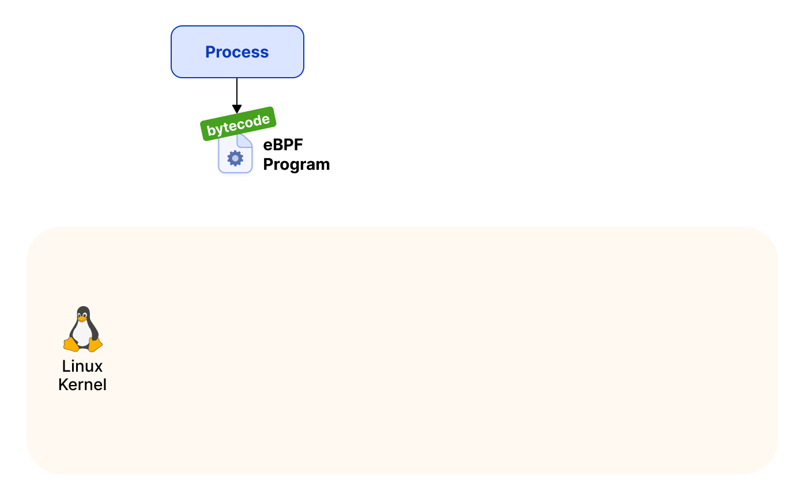

## eBPF

eBPF (enhanced Berkeley Packet Filter) is a revolutionary technology with origins in the Linux kernel that can run sandboxed programs in an operating system kernel. It is used to safely and efficiently extend the capabilities of the kernel without requiring to change kernel source code or load kernel modules.

eBPF is a kernel technology that allows to dynamically extend the functionalities of the Linux kernel at runtime.

You can think of it as what JavaScript is to the web browser: JavaScript lets you attach callbacks to events in the DOM in order to bring dynamic features to your web page. In a similar fashion, eBPF allows to hook to kernel events and extend their logic when these events are triggered!



## This Repo

I have included some example programs for you to test out, and I will push more programs in this repository only.
To run these programs, you need:

```bash
Linux kernel version 5.7 or later, for bpf_link support
LLVM 11 or later 1 (clang and llvm-strip) (sudo apt install clang && sudo apt install llvm-strip)
libbpf headers 2
Linux kernel headers 3
Go compiler version supported by ebpf-go's Go module
```

These programs are pushed with the binary, but if you want to do some changes and then run, use following steps after your changes:

```bash
go generate 
go build
```

`go generate` will compile the C code using clang and `go build` will compile the go binary which then can be used by directly executing the binary.

## Examples

* [Example from the docs](./example/)
* [To intercept IP packets from NIC and display address](./show-ip/)

## Resources

* [eBPF.io](https://ebpf.io/)
* [Books](https://ebpf.io/get-started/#books)
* [Labs](https://ebpf.io/labs/)
* [eBPF-go(used here)](https://ebpf-go.dev/guides/getting-started/)

## Footnote

I personally find eBPF an amazing tool, it lets us safely extend the capabilites of the Kernel without go through the whole long cycle of creating, testing and pushing patches to the mainline kernel. It helps in instrumenting the kernel like never before, and with the advent of cloud-native technologies, eBPF is the game changer.